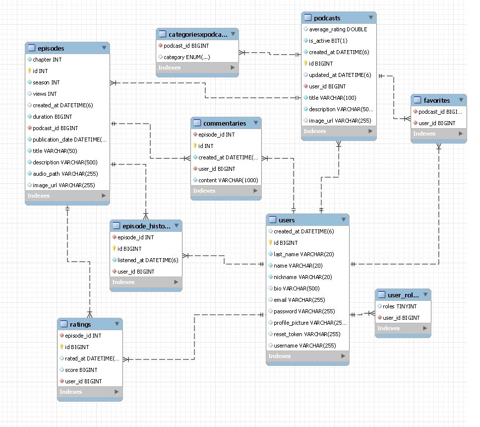
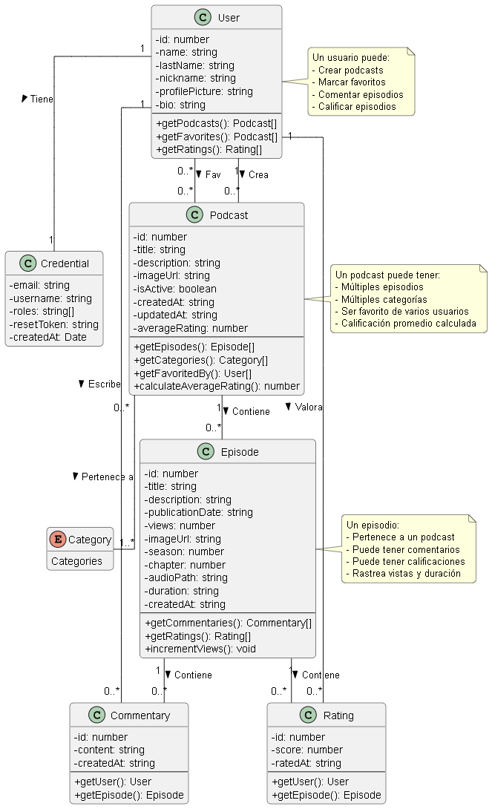

# 🎧 Podcast API

Una API RESTful para gestionar la plataforma Wavely. Permite registrar y autenticar usuarios, publicar podcasts y episodios, reproducir y calificar contenido, gestionar favoritos y playlists, seguir creadores, recibir notificaciones y obtener recomendaciones. Este backend está pensado para ser consumido por el frontend web incluido en el proyecto.

---

## 🚀 Tecnologías

- **Lenguaje:** Java 21
- **Framework:** Spring Boot 3.5.0
- **Seguridad:** Spring Security y JWT
- **Base de datos:** MySQL
- **ORM:** Spring Data JPA / Hibernate
- **Documentación:** OpenAPI / Swagger UI
- **Tiempo real:** WebSocket con STOMP
- **Integraciones:** Cloudinary y Google Identity
- **Testing:** JUnit y Mockito

---

## 📂 Estructura del modelo

**Diagrama Entidad - Relación**



**Diagrama UML**



### 👤 `users`
Contiene la información básica y las credenciales del usuario.

- `name`, `last_name`, `nickname`, `email`, `username`
- `bio`, `profile_picture`
- `password` almacenado mediante hash
- Roles y proveedor de autenticación local o Google

### 🗂 `podcasts`
Representa cada podcast creado por un usuario.

- `title`, `description`, `image_url`
- `is_active`: indica si el podcast está activo
- Relación con el usuario creador, episodios, categorías y favoritos

### 📚 `categoriesxpodcasts`
Relación utilizada para categorizar podcasts.

- `podcast_id`, `category` (`ENUM`)

### 🎙 `episodes`
Episodios pertenecientes a un podcast.

- `title`, `description`, `duration`, `audio_path`, `image_url`
- `publication_date`, `season`, `chapter`, `average_rating`, `views`
- Relaciones con podcasts, comentarios, calificaciones e historial

### 🧾 `episode_history`
Historial de reproducción del usuario.

- Relaciona un usuario con un episodio reproducido
- Registra la fecha de reproducción

### 💬 `commentaries`
Comentarios publicados por los usuarios en episodios.

- `user_id`, `episode_id`, `content`, `created_at`

### ❤️ `favorites`
Relación entre usuarios y podcasts guardados como favoritos.

- `user_id`, `podcast_id`

### 🔐 `user_roles`
Roles asociados a las credenciales de los usuarios.

- Roles disponibles: `ROLE_USER`, `ROLE_CREATOR` y `ROLE_ADMIN`

### 📋 `playlists` y `playlist_items`
Listas creadas por los usuarios y contenido agregado a ellas.

- Una playlist pertenece a un usuario
- Sus elementos pueden referenciar podcasts o episodios
- Los elementos conservan un orden configurable

### 🔔 `notifications`
Notificaciones generadas por la actividad de la plataforma.

- Registra emisor, receptor, tipo, mensaje, fecha y estado de lectura
- Puede asociarse a podcasts, episodios o comentarios

### 👥 `user_follows`
Relación de seguimiento entre usuarios.

- Registra quién sigue a quién
- Permite activar o desactivar notificaciones del creador seguido

---

## 📡 Endpoints (ejemplos)

> ⚠️ Todos los endpoints utilizan el prefijo `/podcastUTN/v1` y devuelven JSON. La documentación completa está disponible mediante Swagger UI en `/swagger-ui.html`.

### Autenticación
- `POST /podcastUTN/v1/users/register` → Crea un usuario
- `POST /podcastUTN/v1/auth/login` → Inicia sesión y devuelve un JWT
- `POST /podcastUTN/v1/auth/google` → Autentica mediante Google

### Usuarios
- `GET /podcastUTN/v1/users/myProfile` → Obtiene el perfil autenticado
- `GET /podcastUTN/v1/users/{userId}` → Obtiene un perfil público
- `PATCH /podcastUTN/v1/users/myProfile` → Edita el perfil autenticado
- `GET /podcastUTN/v1/users/myFavorites` → Lista los favoritos
- `GET /podcastUTN/v1/users/myHistory` → Lista el historial

### Podcasts
- `GET /podcastUTN/v1/podcasts` → Lista y busca podcasts
- `POST /podcastUTN/v1/podcasts` → Crea un podcast
- `GET /podcastUTN/v1/podcasts/{podcastId}` → Obtiene el detalle
- `PATCH /podcastUTN/v1/podcasts/{podcastId}` → Edita un podcast propio
- `DELETE /podcastUTN/v1/podcasts/{podcastId}` → Elimina un podcast propio

### Episodios
- `GET /podcastUTN/v1/episodes/{episodeId}` → Obtiene un episodio
- `GET /podcastUTN/v1/episodes/{episodeId}/play` → Registra y devuelve la reproducción
- `POST /podcastUTN/v1/episodes` → Crea un episodio
- `PATCH /podcastUTN/v1/episodes/{episodeId}` → Edita un episodio propio
- `DELETE /podcastUTN/v1/episodes/{episodeId}` → Elimina un episodio propio

### Comentarios y calificaciones
- `GET /podcastUTN/v1/episodes/{episodeId}/commentaries` → Lista comentarios
- `POST /podcastUTN/v1/episodes/{episodeId}/comment` → Agrega un comentario
- `PATCH /podcastUTN/v1/episodes/{episodeId}/commentaries/{commentaryId}` → Edita un comentario propio
- `DELETE /podcastUTN/v1/episodes/{episodeId}/commentaries/{commentaryId}` → Elimina un comentario propio
- `POST /podcastUTN/v1/users/{episodeId}/rate` → Califica un episodio

### Playlists, seguimiento y notificaciones
- `GET /podcastUTN/v1/playlists` → Lista las playlists del usuario
- `POST /podcastUTN/v1/playlists` → Crea una playlist
- `POST /podcastUTN/v1/follows/{userId}` → Sigue a un usuario
- `GET /podcastUTN/v1/follows/my-following` → Lista los usuarios seguidos
- `GET /podcastUTN/v1/notifications` → Lista las notificaciones
- `PATCH /podcastUTN/v1/notifications/read-all` → Marca todas como leídas

### Recomendaciones
- `GET /podcastUTN/v1/recommendations` → Obtiene recomendaciones personalizadas
- `GET /podcastUTN/v1/recommendations/trending` → Obtiene contenido en tendencia
- `GET /podcastUTN/v1/recommendations/dice` → Obtiene una recomendación aleatoria

---

## 🛠 Instalación

### Requisitos previos

- Java 21
- Una instancia de MySQL accesible

### Configuración

Configurá `PodcastProject/src/main/resources/application.properties` o sus variables de entorno equivalentes:

```properties
spring.datasource.url=jdbc:mysql://localhost:3306/podcastutn
spring.datasource.username=TU_USUARIO
spring.datasource.password=TU_CONTRASEÑA
jwt.secret=TU_SECRETO_JWT
cloudinary.cloud-name=TU_CLOUD_NAME
cloudinary.api-key=TU_API_KEY
cloudinary.api-secret=TU_API_SECRET
google.client-id=TU_GOOGLE_CLIENT_ID
```

No publiques credenciales reales en el repositorio.

### Ejecución local

```bash
cd BackEnd/PodcastProject
./mvnw spring-boot:run
```

En Windows:

```powershell
cd BackEnd\PodcastProject
.\mvnw.cmd spring-boot:run
```

La API queda disponible en `http://localhost:8080`.

### Docker

El backend incluye un `Dockerfile` y también puede ejecutarse junto con el frontend mediante el archivo `docker-compose.yml` ubicado en la raíz del repositorio.

---

## 🧪 Testing de la API

Para ejecutar los tests automatizados:

```bash
cd BackEnd/PodcastProject
./mvnw test
```

También podés probar la API desde Swagger UI o Postman. En los endpoints protegidos incluí el token obtenido durante el login:

```http
Authorization: Bearer <tu_token>
```

### ✅ Flujo sugerido para testeo manual

1. Registrar un usuario con `POST /podcastUTN/v1/users/register`.
2. Iniciar sesión con `POST /podcastUTN/v1/auth/login`.
3. Crear un podcast con `POST /podcastUTN/v1/podcasts`.
4. Crear un episodio con `POST /podcastUTN/v1/episodes`.
5. Reproducirlo con `GET /podcastUTN/v1/episodes/{episodeId}/play`.
6. Comentar con `POST /podcastUTN/v1/episodes/{episodeId}/comment`.
7. Calificar con `POST /podcastUTN/v1/users/{episodeId}/rate`.
8. Agregar el podcast a favoritos con `POST /podcastUTN/v1/users/favorites/{podcastId}`.
9. Consultar el historial con `GET /podcastUTN/v1/users/myHistory`.
10. Consultar los favoritos con `GET /podcastUTN/v1/users/myFavorites`.

---

## 📁 Colecciones Postman

Para facilitar el testing de la API, podés importar las siguientes colecciones de Postman, organizadas por módulo:

- 🎧 **Episodios**  
  [🔗 Ver colección de Episodios](https://intelangelofelipe.postman.co/workspace/Intelangelo-Felipe's-Workspace~be26952f-9c9f-40b0-89c2-6c98002e26fb/collection/45430153-7c3e5f6e-cd55-4802-9653-99bd628340cd?action=share&creator=45430153)

- 📻 **Podcasts**  
  [🔗 Ver colección de Podcasts](https://intelangelofelipe.postman.co/workspace/Intelangelo-Felipe's-Workspace~be26952f-9c9f-40b0-89c2-6c98002e26fb/collection/45430153-46933ec1-9ee0-43be-9b19-e5c42a4d8e7c?action=share&creator=45430153)

- 👤 **Usuarios**  
  [🔗 Ver colección de Usuarios](https://intelangelofelipe.postman.co/workspace/Intelangelo-Felipe's-Workspace~be26952f-9c9f-40b0-89c2-6c98002e26fb/collection/45430153-8f9113fd-7b5f-4a90-b51f-0a3a0c702ea7c?action=share&creator=45430153)

> 💡 Tip: Podés importar los enlaces directamente en Postman desde `File > Import > Link`.
